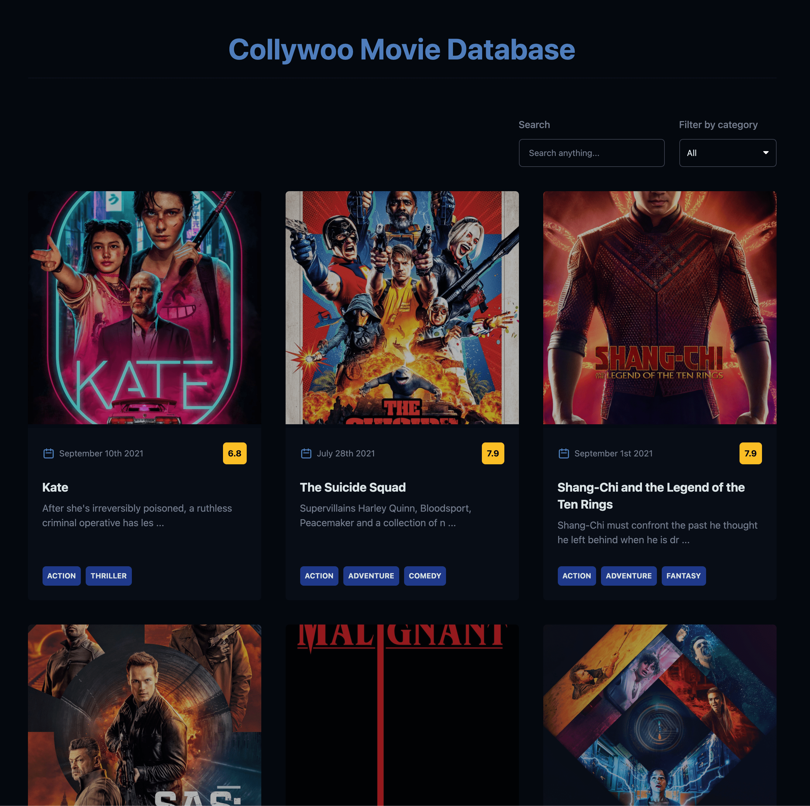

# **Collywoo: Movie Database**

This project is powered by **React**.

Created with **The Movie Database (TMDB) API**.

<br>



<br>

## Installation

Use these commands to install the dependencies and start the server.

1. **Clone from Github**

   ```
   $ git clone git@github.com:devmaroy/collywoo-movie-database_cu_pe_re_en.git
   ```

2. **Install dependencies**
   ```
   $ yarn install / npm install
   ```

3. **Navigate into your directory where you cloned repository**

   ```
   $ cd my-folder
   ```

4. **Add The Movie Database (TMDB) API**

   Add the environment variable.

   ```
   API_KEY=your-api-key-v3
   API_URL=http://api.themoviedb.org/3
   API_IMAGE_URL=http://image.tmdb.org/t/p/original
   API_IMAGE_LOWRES_URL=https://image.tmdb.org/t/p/w300
   ```

5. **Start it up** `$ yarn start` <br>

**Your site is now running at `http://localhost:8080`!**

<br>

## Structure

A quick look at the top-level files and directories you'll see in my project.

    .
    ├── node_modules
    ├── app
    ├── .env
    ├── .env.example
    ├── .eslintignore
    ├── .eslintrc.js
    ├── .gitignore
    ├── .prettierignore
    ├── .prettierrc
    ├── .stylelintignore
    ├── .stylelintrc
    ├── package.json
    ├── package-lock.json
    ├── README.md
    ├── screenshot.png
    ├── tailwind-default.config.js
    ├── tailwind.config.js
    ├── webpack.config.js
    ├── yarn-error.log
    └── yarn.lock

<br>

1.  **`/app`**: This directory will contain all of the code related to what you
    will see on the front-end of site (what you see in the browser) such as site
    header or a page template. `app` is a convention for “application”.

2.  **`/node_modules`**: This directory contains all of the modules of code that
    project depends on (npm packages) are automatically installed.

3.  **`.env`**: Yours configuration for .env file.

4.  **`.env.example`**: Example configuration for .env file.

5.  **`.eslintignore`**: Configuration file for eslint - for files to ignore.

6.  **`.eslintrc.js`**: Configuration file for eslint.

7.  **`.gitignore`**: This file tells git which files it should not track / not
    maintain a version history for.

8.  **`.prettierignore`**: Configuration file for prettier - for files to
    ignore.

9. **`.prettierrc`**: Configuration file for prettier.

10. **`.stylelintignore`**: Configuration file for style lint - for files to
    ignore.

11. **`.stylelintrc`**: Configuration file for style lint.

12. **`package.json`**: A manifest file for Node.js projects, which includes
    things like metadata (the project’s name, author, etc). This manifest is how
    npm knows which packages to install for project.

13. **`package-lock.json`** (See `package.json` below, first). This is an
    automatically generated file based on the exact versions of npm dependencies
    that were installed for project. **(You won’t change this file directly).**

14. **`README.md`**: A text file containing useful reference information about
    project.

15. **`screenshot.png`**: Screenshot of the final website.

16. **`tailwind-default.config.js`**: Original Tailwind settings.

17. **`tailwind.config.js`**: By default, Tailwind will look for an optional 
    tailwind.config.js file at the root of your project where you can define 
    any customizations. Make your custom modifications here.
    See tailwind-default.config.js for more info and inspiration.

18. **`webpack.config.js`**: A configuration file in Webpack is basically 
    a common.js module. The config file is a place to put all of your 
    configuration, loaders and other specific information relating to your build.

19. **`yarn-error.log`**: The whole point of it is that you read the log to find
    out what went wrong, and if you've not had any errors, it might not even
    exist at all.

20. **`yarn.lock`**: There is an identifier for every dependency and sub
    dependency that is used for a project.

<br>

<hr>

<br>

### Live example:

**[collywoo-movie-database.marekmatejovic.com](https://collywoo-movie-database.marekmatejovic.com)**
